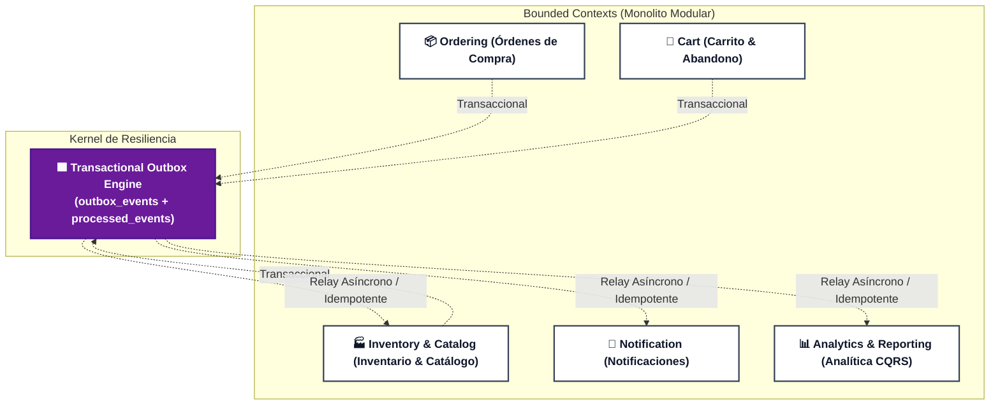

# 🛒 Arka - Plataforma B2B de Distribución Mayorista (Backend MVP)

Bienvenido al repositorio central de **Arka**, la solución de backend para la distribución mayorista de accesorios de PC a almacenes en Colombia y Latinoamérica (Ecuador, Perú, Chile). Este sistema automatiza la gestión de órdenes de compra, control de inventario concurrente anti-sobreventa, carritos abandonados, notificaciones de estados y analítica estratégica de negocio.

---

## 🏛️ Arquitectura: Monolito Modular con Minimal DDD (Java 25)

El sistema está concebido como un **Monolito Modular** estructurado bajo el paradigma **Minimal DDD** (*Domain + Infrastructure*), con **Transactional Outbox & Idempotent Consumer** para el desacoplamiento reactivo de efectos secundarios y preparación nativa para evolución hacia microservicios en la nube.



---

## 📦 Bounded Contexts y Responsabilidades de Negocio

| Bounded Context | Esquema de BD | Responsabilidades y Agregados Clave | Historias de Usuario | Invariantes Protegidas |
| :--- | :---: | :--- | :---: | :--- |
| **`inventory`** | `inventory` | **🟨 Product** & **🟨 InventoryItem**:<br/>Registro de productos, atributos PC, control de stock físico, reserva transaccional anti-sobreventa y alertas de umbral crítico. | **HU1, HU2, HU3** | `INV-01` (Integridad de producto)<br/>`INV-02` (Stock no negativo)<br/>`INV-03` (Reserva anti-sobreventa)<br/>`INV-08` (Alerta de stock bajo) |
| **`ordering`** | `ordering` | **🟨 PurchaseOrder**:<br/>Radicación de pedidos B2B, modificación de pedidos en estado pendiente, confirmación, despacho y entrega. | **HU4, HU5, HU6** | `INV-04` (Modificable solo PENDIENTE)<br/>`INV-05` (Transición formal de estados)<br/>`INV-06` (Mínimo 1 producto) |
| **`cart`** | `cart` | **🟨 Cart**:<br/>Gestión de carrito de compras del cliente y detección automática de carritos abandonados tras inactividad. | **HU8** | `INV-07` (Inactividad > umbral) |
| **`notification`** | `notification` | **🟨 NotificationRecord**:<br/>Consumidor idempotente que despacha notificaciones ante hitos de orden y recordatorios de carrito. | **HU6, HU8** | Idempotencia at-least-once |
| **`analytics`** | `analytics` | **🟩 Proyecciones CQRS**:<br/>Read models actualizados por eventos para reportes de ventas semanales (top productos/clientes) y reposición. Exportación CSV y JSON. | **HU7, HU3** | Pureza CQRS desde Domain Events |
| **`shared`** | `shared` | **🟪 Kernel de Resiliencia**:<br/>`outbox_events` y `processed_events` para entrega at-least-once desacoplada. | Infraestructura | Transaccionalidad atómica |

---

## 👥 Actores de Negocio y Roles del Sistema

| Actor / Disparador | Tipo | Bounded Contexts | Comandos / Acciones Principales | Historias de Usuario |
| :--- | :---: | :--- | :--- | :---: |
| **👤 Administrador** | Humano (Backoffice) | `inventory`, `analytics` | • Registrar nuevos productos con especificaciones técnicas de PC.<br/>• Ajustar stock físico y mantener historial de auditoría.<br/>• Consultar y exportar reportes semanales de ventas y reposición. | **HU1, HU2, HU3, HU7** |
| **👤 Cliente Mayorista** | Humano (B2B) | `cart`, `ordering`, `notification` | • Gestionar ítems en el carrito de compras.<br/>• Radicar órdenes de compra al por mayor con validación de stock.<br/>• Modificar pedidos antes de su confirmación (estado `PENDIENTE`).<br/>• Recibir notificaciones de progreso de órdenes y carritos abandonados. | **HU4, HU5, HU6, HU8** |
| **👤 Operador Logístico** | Humano (Operaciones) | `ordering` | • Despachar pedidos confirmados (`DISPATCHED`).<br/>• Marcar pedidos como entregados en destino (`DELIVERED`). | **HU6** |
| **⏱️ Scheduler de Stock** | Sistema (Temporizado) | `inventory`, `analytics` | • Evaluar periódicamente niveles de inventario frente a umbrales mínimos.<br/>• Disparar alertas de reposición crítica para abastecimiento. | **HU3** |
| **⏱️ Scheduler de Inactividad** | Sistema (Temporizado) | `cart`, `notification` | • Evaluar tiempo de inactividad de carritos abiertos.<br/>• Marcar carritos como abandonados para activar campañas de recuperación. | **HU8** |

---

## 🧭 Catálogo Navegable de Documentación Técnica (Living Documentation)

Toda la arquitectura se encuentra especificada en código y diagramas Mermaid interactivos:

* 🗺️ **[Strategic System Context Map](docs/architecture/system-context-map.mmd)**: Mapa estratégico DDD puro con roles Upstream/Downstream (U/D), OHS, PL y Customer/Supplier.
* 🌪️ **[Feature Storming Global (MVP)](docs/architecture/features/arka-mvp/feature-storming.mmd)**: Event Storming end-to-end con descomposición de flujos, comandos, agregados e invariantes.
* 🔄 **[Diagramas de Secuencia](docs/architecture/sequence-diagrams.md)**: Flujos dinámicos de Happy Path, modificación de pedidos, rechazo RFC 9457 y Fan-Out asíncrono.
* 📦 **[Guía Transactional Outbox](docs/architecture/transactional-outbox-workflow.md)**: Manual de resiliencia, esquemas SQL, publicación y consumo idempotente.
* 📐 **Event Storming por Contexto**:
  * [Inventory Context](docs/architecture/contexts/inventory/event-storming.mmd)
  * [Ordering Context](docs/architecture/contexts/ordering/event-storming.mmd)
  * [Cart Context](docs/architecture/contexts/cart/event-storming.mmd)
  * [Notification Context](docs/architecture/contexts/notification/event-storming.mmd)
  * [Analytics Context](docs/architecture/contexts/analytics/event-storming.mmd)
* 🧪 **[Living API Test Suite (requests.http)](requests.http)**: Peticiones HTTP ejecutables para todos los casos de uso y violaciones de invariantes.
* 🖥️ **[Portal Frontend B2B en Angular (Living UI)](frontend/README.md)**: Mapeo de Bounded Contexts, Signals, sistema de temas Dark/Light y proxy de desarrollo.


---

## 🗄️ Tabla de Datos Semilla Interactivos (`src/main/resources/data.sql`)

La base de datos en memoria H2 se precarga automáticamente con los siguientes registros:

| Tipo | Identificador (UUID) | Nombre / Detalle | Stock Físico / Umbral | Propósito de Prueba |
| :--- | :--- | :--- | :---: | :--- |
| **Producto** | `11111111-1111-1111-1111-111111111111` | Mouse Ergonómico Inalámbrico Pro | 50 / 10 | Stock disponible para pedidos y reservas |
| **Producto** | `22222222-2222-2222-2222-222222222222` | Teclado Mecánico RGB Switch Blue | 30 / 5 | Stock disponible para carritos y órdenes |
| **Producto** | `33333333-3333-3333-3333-333333333333` | Monitor Gamer 27" 165Hz | 15 / 5 | Pruebas de sobreventa (INV-03) |
| **Producto** | `44444444-4444-4444-4444-444444444444` | Cable HDMI 2.1 Ultra High Speed | **3 / 10** | **Stock Crítico**: Alerta de abastecimiento (HU3) |
| **Cliente** | `aaaaaaaa-aaaa-aaaa-aaaa-aaaaaaaaaaaa` | Almacén Mayorista Medellín | N/A | Cliente de prueba para pedidos y carrito |
| **Cliente** | `bbbbbbbb-bbbb-bbbb-bbbb-bbbbbbbbbbbb` | Distribuidora Bogotá | N/A | Cliente secundario para analítica |

---

## 🚀 Guía de Verificación Inmediata

### 1. Compilación y Ejecución de la Aplicación
```bash
# Ejecutar la suite de pruebas completa y generar reporte JaCoCo
./gradlew test jacocoTestReport

# Levantar el servidor backend
./gradlew bootRun
```
El servidor iniciará en `http://localhost:8080`.

### 2. Acceso a la Consola H2 Web
* **URL**: [http://localhost:8080/h2-console](http://localhost:8080/h2-console)
* **JDBC URL**: `jdbc:h2:mem:arkadb`
* **User Name**: `sa`
* **Password**: *(en blanco)*

### 3. Conexión desde DataGrip / DBeaver / Clientes Externos (TCP Server)
Para conectarte a la base de datos en memoria mientras el backend está corriendo (`./gradlew bootRun`), usa el servidor TCP H2 habilitado en el puerto `9092`:

* **Driver**: H2
* **Connection Type / URL format**: `URL only`
* **JDBC URL**: `jdbc:h2:tcp://localhost:9092/mem:arkadb`
* **User**: `sa`
* **Password**: *(dejar vacío)*

> 💡 **Nota DataGrip**: Crea un nuevo Data Source con **Driver: H2**, selecciona el modo de conexión por **URL only**, pega `jdbc:h2:tcp://localhost:9092/mem:arkadb`, y haz clic en **Test Connection** (asegúrate de que el backend esté corriendo previamente).

Tablas clave para inspeccionar:
* `products`, `inventory_items`
* `purchase_orders`, `order_items`
* `carts`, `cart_items`
* `notifications`
* `outbox_events` (Verificar estados `PENDING` ➡️ `PROCESSED`)
* `processed_events` (Control de idempotencia en consumidores)
* `projection_product_sales`, `projection_customer_sales`, `projection_replenishment`

### 4. Documentación Interactiva Swagger / OpenAPI 3.0
* **Swagger UI**: [http://localhost:8080/swagger-ui.html](http://localhost:8080/swagger-ui.html)
* **OpenAPI Spec (JSON)**: [http://localhost:8080/v3/api-docs](http://localhost:8080/v3/api-docs)

Permite inspeccionar y ejecutar interactivamente todos los endpoints clasificados por Bounded Contexts (`Inventory & Catalog`, `Ordering`, `Cart & Abandonment`, `Notification`, `Analytics & Reporting`), con esquemas de DTOs y respuestas de error estandarizadas RFC 9457 `ProblemDetail`.

### 5. Ejecución de Pruebas de API con `requests.http`
Abre el archivo [`requests.http`](requests.http) en IntelliJ IDEA, VS Code (con extensión REST Client) o tu cliente HTTP preferido y ejecuta las peticiones ordenadas por secciones:
1. **Happy Path Catálogo e Inventario**: Registro, consulta por categorías y ajuste con auditoría.
2. **Carrito y Carrito Abandonado**: Adición de ítems y detección automática de abandono.
3. **Ciclo de Vida de Órdenes**: Radicación, reserva preventiva, modificación en estado pendiente, confirmación, despacho y entrega.
4. **Notificaciones y Reportes**: Consulta de emails despachados y reportes en JSON o CSV.
5. **Violación de Invariantes (RFC 9457)**: Comprobación de rechazos 400 y 422 con `ProblemDetail`.
