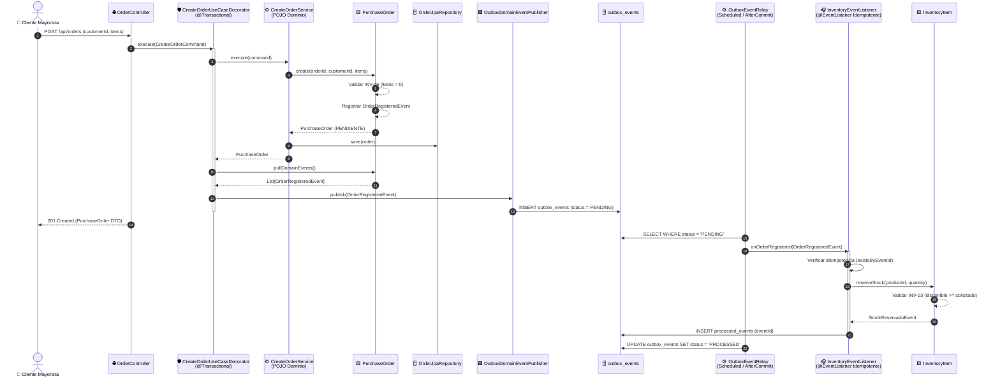
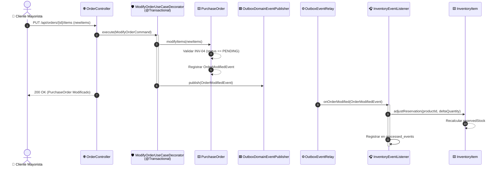
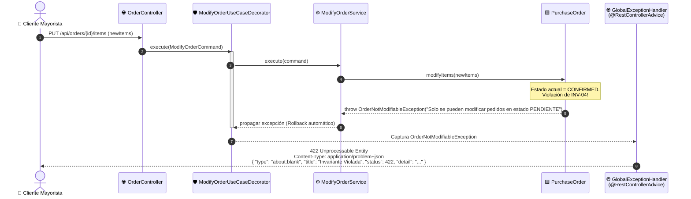
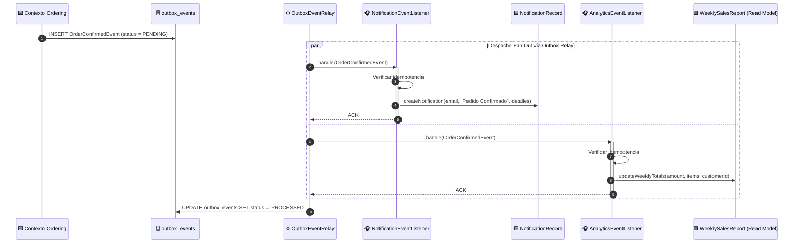

# 🔄 Diagramas de Secuencia: Arka Modular Monolith (Minimal DDD & Java 25)

Este documento detalla las interacciones dinámicas de los principales flujos del sistema, ilustrando la transaccionalidad atómica, el desacoplamiento mediante **Transactional Outbox**, la idempotencia y el manejo de errores estandarizado con **RFC 9457 ProblemDetail**.

---

## 1. Happy Path: Creación y Confirmación de Orden B2B con Transactional Outbox

Ilustra la radicación de la orden por parte del cliente mayorista, la persistencia atómica en la misma transacción ACID de la orden y del evento en `outbox_events`, y el relay asíncrono hacia el inventario para reservar stock preventivo.

---

## 2. Modificación de Pedido Pendiente y Reajuste de Reserva

El cliente actualiza cantidades antes de la confirmación formal del pedido (`INV-04`).

---

## 3. Rechazo de Invariante de Dominio: RFC 9457 ProblemDetail (422 Unprocessable)

Cuando una operación viola reglas duras de negocio (ej. modificar una orden que ya fue confirmada o despachada).

---

## 4. Fan-Out Asíncrono hacia Notificaciones y Proyecciones Analíticas

Al confirmarse una orden, el evento `OrderConfirmedEvent` es consumido concurrentemente por los contextos `notification` y `analytics`.

